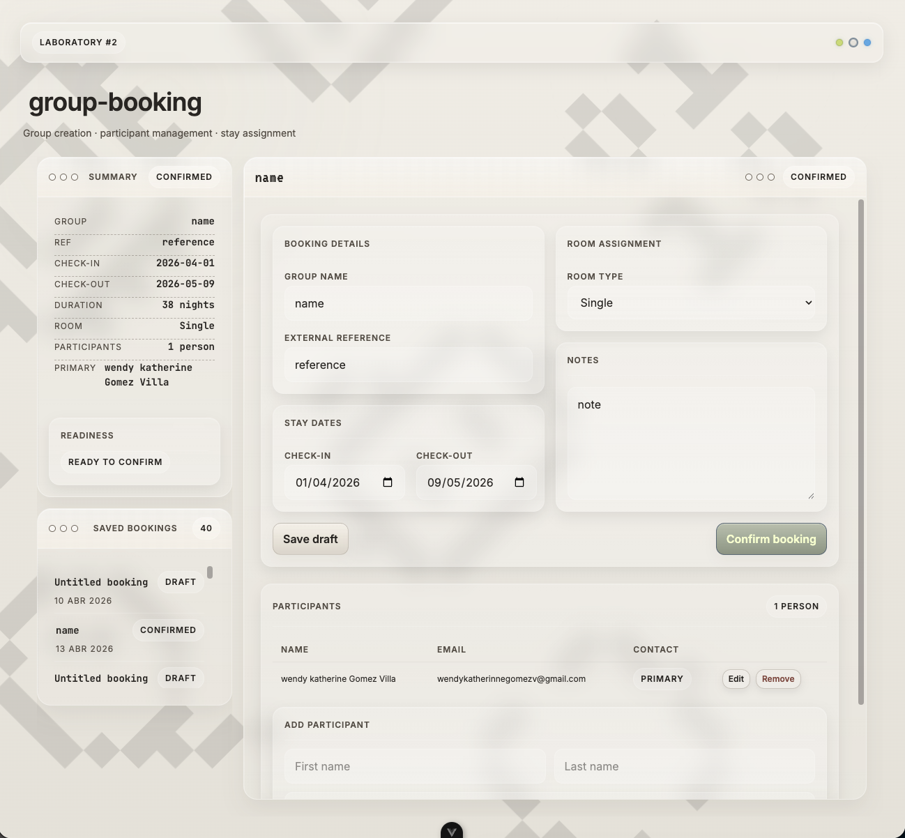

# Group Booking Editor Demo

A portfolio-grade **Vue 3 + TypeScript** Laboratory that showcases a structured group booking flow with a strongly typed domain model, validation rules, mock persistence, and a dashboard-style editor UI.

This project simulates the creation and editing of a group booking, where a user can manage booking details, stay dates, room assignment, participants, status transitions, and saved drafts through a clean and explainable frontend architecture.

The goal of this lab is to demonstrate:

- clean domain modeling
- reusable booking validation rules
- a structured editor flow from route to composable to UI
- service-layer abstraction prepared for future backend integration
- participant and booking state management
- a reusable retro-tech visual system integrated into a real app

## Preview



## Domain Model

[View the domain model](docs/domain-model.md)

---

## Features

- **Group booking creation and editing**
- **Strongly typed booking domain**
- **Draft and confirmed booking states**
- **Reusable validation rules** for confirmation readiness
- **Participant management** with a single primary contact flow
- **Mock service layer** prepared for future API replacement
- **Saved bookings side panel** for quick reopening of persisted drafts
- **Retro-tech themed UI** with a shared design system
- **Dashboard-style editor layout**

---

## Tech Stack

### App

- Vue 3
- TypeScript
- Vite
- Vue Router
- Tailwind CSS
- daisyUI

### Domain / Services

- Strongly typed domain entities and value objects
- Pure validation rules
- Mock persistence through a service layer
- Composable-based editor orchestration

### UI / Design System

- Shared local design system package:
  `@wendy/retro-tech-foundation`

---

## Project Goal

This demo was built to recreate a real-world group booking / reservation editing problem in a simplified but defendable way.

It focuses on the kind of engineering decisions needed in production systems:

- separating domain logic from UI concerns
- keeping validation logic outside presentational components
- preparing frontend architecture for a future backend
- structuring editor flows around composables and typed services
- building a reusable interface system that can evolve over time

---

## How It Works

### Booking Flow

1. User opens a new or existing group booking
2. User edits booking details
3. User defines stay dates
4. User selects a room type
5. User adds, edits, and removes participants
6. User marks a primary contact
7. User saves the booking as a draft
8. User confirms the booking when validation rules pass
9. UI updates the summary sidebar and saved bookings list

### Booking Inputs

The booking editor is based on:

- group name
- external reference
- notes
- stay date range
- room assignment / room type
- participant list
- primary contact
- booking status

---

## Booking Validation Rules

A booking can exist in **draft** state with partial information.

A booking can only be confirmed when the required rules are satisfied.

### Confirmation Rules

- `groupName` is required
- `checkIn` is required
- `checkOut` is required
- `checkOut` must be later than `checkIn`
- at least one participant must exist
- exactly one participant should act as primary contact
- a room type must be selected

Validation is designed so the same domain rules can later support a real backend without rewriting the UI flow.

---

## Architecture

This project uses a lightweight frontend architecture with clear separation between domain, service, orchestration, and UI layers:

- `src/domain/booking` → entities, value objects, defaults, rules
- `src/services/booking` → service contract and mock implementation
- `src/composables` → booking editor orchestration
- `src/components/booking` → presentational editor components
- `src/pages` → route-level editor screens

### Domain Model

See the domain diagram here:

[Domain Model](./docs/domain-model.md)

---

## Project Structure

```txt
src/
  app/
    router/
  components/
    booking/
  composables/
    booking/
  domain/
    booking/
      entities/
      value-objects/
  pages/
  services/
    booking/
docs/
  domain-model.md